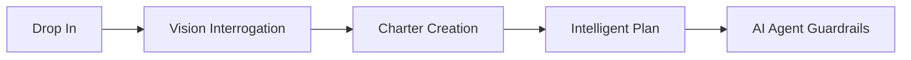
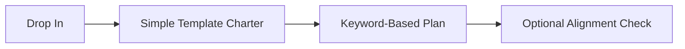

# AI-Onboard System Flow & Production Readiness Analysis

## 🎯 Executive Summary

AI-Onboard is designed as a **drop-in project coach** that establishes a strong foundation before allowing AI agents to make changes. Here's how the system works and the current status of key features.

---

## 🚀 Complete System Flow: New Project Onboarding

### **Phase 1: Initial Drop-In (What Actually Happens)**

When you first install AI-Onboard in a project directory:

```bash
pip install -e .
python -m ai_onboard charter
```

**Current Implementation:**

1. **Charter Creation** (`charter.py`)
   - Creates `.ai_onboard/charter.json` with a minimal template
   - Sets project name to directory name
   - Uses **simple template**, not interactive interrogation
   - Template includes: vision, objectives, stakeholders, constraints

**What the Charter Template Includes:**

```json
{
  "version": 1,
  "project_name": "your-project-name",
  "vision": "One sentence purpose.",
  "objectives": [],
  "non_goals": [],
  "stakeholders": [{"name": "Owner", "role": "PM", "decider": true}],
  "constraints": {"time": "", "budget": "", "compliance": []},
  "success_metrics": [{"name": "Lead time", "target": "<7d"}],
  "risk_appetite": "medium"
}
```

---

### **Phase 2: Project Planning**

```bash
python -m ai_onboard plan
```

**Current Implementation** (`ai_onboard/core/vision/planning.py`):

1. **Reads Charter**: Loads `.ai_onboard/charter.json`
2. **Generates WBS**: Creates work breakdown structure based on charter content
   - Looks for keywords in objectives ("gate", "agent", "improvement")
   - Creates high-level phases (C1, C2, C3, etc.)
   - Each phase has dependencies

3. **Generates Tasks**: Expands WBS into detailed tasks
   - Maps each WBS item to specific implementation tasks
   - Estimates effort in days
   - Tags tasks by type (setup, design, development)

4. **Dependency Analysis**: Calculates critical path
   - Identifies which tasks can run in parallel
   - Determines critical path tasks
   - Maps task dependencies

5. **Milestones & Risks**: Auto-generates based on charter
   - Creates milestones for major WBS completion
   - Identifies risks based on objectives

**Output**: Creates `.ai_onboard/plan.json`

---

### **Phase 3: Alignment & Validation**

```bash
python -m ai_onboard align
python -m ai_onboard validate
```

**Alignment** (`ai_onboard/core/vision/alignment.py`):

- Checks if current work aligns with charter vision
- Scores alignment based on objectives matching
- Reports drift if work doesn't match goals

**Validation** (`validation_runtime.py`):

- Runs comprehensive health checks
- Checks charter, plan, and project status
- Requires vision to be "confirmed" first

---

## 🔍 Critical Analysis: What Works vs. What Doesn't

### ✅ **What Works Reliably**

1. **Charter Creation (Basic)**
   - ✅ Creates template successfully
   - ✅ Saves to `.ai_onboard/charter.json`
   - ✅ Simple, predictable output

2. **Plan Generation (Mechanical)**
   - ✅ Reads charter and generates plan
   - ✅ Creates valid JSON structure
   - ✅ Dependencies are logically sound
   - ✅ WBS structure is reasonable

3. **State Management**
   - ✅ Tracks progression (analyzed → chartered → planned → aligned)
   - ✅ Enforces order of operations

### ⚠️ **What Needs Attention**

#### **1. Vision Interrogation System (Historically Problematic)**

**Location**: `ai_onboard/core/vision/enhanced_vision_interrogator.py`

**The Problem**:

- **Designed** to be interactive and comprehensive
- **Built** with adaptive questioning, ambiguity detection, quality scoring
- **But**: NOT actually used by default `charter` command
- **Gap**: Charter uses simple template, not the sophisticated interrogation

**Why This Matters**:

- Vision interrogation was meant to **force** clear project definition
- Without it, charters can be vague or incomplete
- This defeats the "halt AI agents until vision is clear" goal

**Current Status**:

```python
# What happens now:
charter.ensure(root, interactive=args.interactive)
# Creates basic template, no interrogation

# What was designed:
EnhancedVisionInterrogator.start_enhanced_interrogation()
# Would ask detailed questions, validate responses, ensure quality
```

**Production Recommendation**:

- Either: Make vision interrogation the default for new projects
- Or: Remove the unused interrogation code to reduce complexity
- **Don't**: Ship with the expectation that it "forces clear vision" when it doesn't

---

#### **2. Project Planning & WBS (Historically Inconsistent)**

**Location**: `ai_onboard/core/vision/planning.py`

**The Problem**:

- WBS generation is **keyword-based**
- Looks for words like "gate", "agent", "improvement" in charter
- If charter is vague (which it often is), WBS is generic

**Example**:

```python
# If charter says "Build a web app":
# → Generic C1, C2, C3 phases
# → Tasks are templated, not project-specific

# If charter says "Build AI agent collaboration with gate system":
# → Specific phases for gates, agents, collaboration
# → More relevant tasks
```

**Why This is Fragile**:

- **Depends entirely on charter quality**
- With simple template charter → generic WBS
- WBS doesn't adapt to actual project structure
- No analysis of existing codebase

**Production Recommendation**:

- Combine charter data with codebase analysis
- Make WBS more adaptive to project reality
- Or: Keep it simple and market it as "template-based" not "intelligent"

---

#### **3. The Gap Between Design and Implementation**

**Designed Flow** (in documentation):



**Actual Flow** (in code):



---

## 🎯 Production Readiness Recommendations

### **Option 1: Simplify & Be Honest**

**Status**: Production-ready with caveats

**Changes Needed**:

1. Document that charter is a **template**, not interrogation
2. Explain WBS is **keyword-driven**, requires good charter input
3. Remove or clearly mark unused vision interrogation code
4. Set expectations: "Provides structure" not "Provides intelligence"

**Pros**:

- System works as-is
- No major code changes
- Clear user expectations

**Cons**:

- Doesn't deliver on "intelligent" promise
- Less differentiation

---

### **Option 2: Connect the Dots**

**Status**: 2-4 weeks to production-ready

**Changes Needed**:

1. Make `charter --interactive` use vision interrogation by default
2. Connect interrogation results to planning system
3. Add codebase analysis to WBS generation
4. Test end-to-end flow extensively

**Pros**:

- Delivers on the vision
- Actually "intelligent"
- Strong differentiation

**Cons**:

- Requires significant integration work
- More testing needed
- Higher complexity

---

### **Option 3: Hybrid Approach** (RECOMMENDED)

**Status**: 1 week to production-ready

**Changes Needed**:

1. Keep simple charter as default (fast path)
2. Add `--interrogate` flag for comprehensive flow
3. Enhance WBS with basic codebase scanning
4. Clear docs on when to use each approach

**Implementation**:

```bash
# Fast path (works now)
python -m ai_onboard charter
python -m ai_onboard plan

# Thorough path (enhanced)
python -m ai_onboard charter --interrogate
python -m ai_onboard plan --analyze-codebase
```

**Pros**:

- Works for both use cases
- Progressive enhancement
- Clear value proposition

---

## 🚦 Current Production Status

### **Ready for Production**

- ✅ Basic charter/plan workflow
- ✅ State management
- ✅ Alignment checking
- ✅ Policy system
- ✅ Self-preservation rules

### **Needs Work**

- ⚠️ Vision interrogation integration
- ⚠️ WBS intelligence vs. templates
- ⚠️ Documentation of actual vs. designed behavior
- ⚠️ User expectations management

### **Should Consider Removing**

- 🤔 Unused vision interrogation code (if not integrating)
- 🤔 Web interface for interrogation (incomplete)
- 🤔 Complex adaptive questioning (if going simple)

---

## 💡 Bottom Line

**Your concerns about vision interrogation, planning, and WBS are valid.**

The system has **well-designed components** that aren't fully connected. You have two paths:

1. **Ship what works** (template-based approach)
   - Fast to production
   - Set correct expectations
   - Clean up unused code

2. **Connect the pieces** (intelligent approach)
   - More work, but delivers vision
   - Differentiates from competitors
   - Requires thorough testing

**Recommendation**: Go with **Option 3 (Hybrid)**. Ship the simple path that works now, add `--interrogate` flag for power users, and iterate based on feedback.

---

## 📋 Next Steps

1. **Decision**: Choose approach (Simplify, Connect, or Hybrid)
2. **Documentation**: Align docs with reality
3. **Testing**: End-to-end workflow validation
4. **Cleanup**: Remove or integrate unused features
5. **User Testing**: Get feedback on actual flow

---

**Questions to Answer**:

1. What's the target user? (Developer vs. PM vs. AI Agent)
2. What's the primary value prop? (Structure vs. Intelligence)
3. How much setup time is acceptable? (5 min vs. 30 min)
4. What's the "wow" moment? (Quick start vs. Deep insight)


