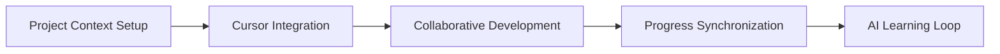

# Cursor AI Integration Workflow

The **Cursor AI Integration Workflow** enables seamless collaboration between AI Onboard and Cursor AI, combining intelligent project management with advanced AI development assistance. This workflow is designed for developers who want to leverage both systems for enhanced productivity.

**⏱️ Time Required**: 20-40 minutes setup, 5-10 minutes daily use
**🎯 Outcome**: Seamless AI-assisted development with intelligent project management
**👥 Best For**: Development teams, individual developers, AI-enhanced workflows

## 🎯 Workflow Overview

This workflow integrates AI Onboard's project management intelligence with Cursor AI's development capabilities:



### What You'll Accomplish

- ✅ **Unified AI Experience**: Seamless integration between project management and development AI
- ✅ **Context-Aware Development**: AI Onboard provides context to Cursor AI for better assistance
- ✅ **Intelligent Workflows**: Automated project updates based on development activities
- ✅ **Enhanced Collaboration**: Human-AI collaboration patterns optimized for productivity
- ✅ **Learning Integration**: Both systems learn from your patterns and improve together

## 🚀 Integration Setup

### Step 1: Initialize Cursor Integration (10 minutes)

Set up the foundational integration between AI Onboard and Cursor AI.

#### Basic Integration Setup

```bash
# Initialize Cursor AI integration
python -m ai_onboard cursor init \
  --integration-level "advanced" \
  --context-sharing "comprehensive" \
  --collaboration-mode "pair_programming"

# Verify integration status
python -m ai_onboard cursor status --comprehensive

# Test basic connectivity
python -m ai_onboard cursor test-connection
```

#### Configure Integration Settings

```bash
# Configure integration preferences
python -m ai_onboard config integrations cursor \
  --enable-context-sharing true \
  --enable-command-translation true \
  --enable-progress-sync true \
  --enable-learning-integration true \
  --collaboration-style "conversational"
```

#### Set Up Project Context

```bash
# Share comprehensive project context
python -m ai_onboard cursor context share \
  --include-charter true \
  --include-plan true \
  --include-progress true \
  --include-dependencies true \
  --include-team-info true \
  --context-focus "current_sprint"
```

### Step 2: Optimize Context Sharing (5-10 minutes)

Configure how project context flows between AI Onboard and Cursor AI.

#### Context Configuration

```bash
# Optimize context sharing settings
python -m ai_onboard cursor context configure \
  --update-frequency "real_time" \
  --context-depth "detailed" \
  --include-recent-changes true \
  --include-code-structure true \
  --include-project-goals true \
  --privacy-level "team_only"
```

#### Custom Context Filters

```bash
# Create context filters for different scenarios
python -m ai_onboard cursor context filter create \
  --name "development_focus" \
  --include "current_sprint,tasks_in_progress,recent_changes,dependencies" \
  --exclude "historical_data,other_teams_work,personal_notes"

python -m ai_onboard cursor context filter create \
  --name "planning_focus" \
  --include "project_charter,upcoming_milestones,team_capacity,risk_factors" \
  --exclude "detailed_code,current_bugs,personal_preferences"
```

### Step 3: Enable Command Translation (5 minutes)

Set up natural language command translation between systems.

#### Translation Setup

```bash
# Enable natural language command translation
python -m ai_onboard cursor translate enable \
  --language-model "advanced" \
  --context-awareness "high" \
  --confidence-threshold 0.8 \
  --fallback-behavior "ask_for_clarification"
```

#### Translation Training

```bash
# Train translation system with your patterns
python -m ai_onboard cursor translate train \
  --sample-commands "charter,plan,dashboard,suggest,validate" \
  --custom-phrases "start new project,check progress,optimize workflow" \
  --context-examples "development_sprint,planning_session,review_meeting"
```

## 🤖 Collaborative Development Workflow

### Step 4: Daily Development Integration (5-10 minutes)

Integrate Cursor AI assistance into your daily development workflow.

#### Morning Setup

```bash
# Get today's development context
python -m ai_onboard cursor context share --focus "today_tasks"

# Review current sprint status
python -m ai_onboard dashboard --sprint-focus

# Get AI development suggestions
python -m ai_onboard suggest --context "development" --ai-enhanced
```

#### Development Session Workflow

```bash
# Start development session with context
python -m ai_onboard cursor session start \
  --mode "development" \
  --focus "current_task" \
  --context-sharing "continuous" \
  --collaboration-style "conversational"

# Natural language development assistance
python -m ai_onboard cursor translate "Help me implement a secure user authentication system"

# Context-aware code suggestions
python -m ai_onboard cursor translate "Optimize this database query for better performance"

# Architecture guidance
python -m ai_onboard cursor translate "Design a scalable API for user management"
```

#### Progress Updates

```bash
# Update progress based on development activities
python -m ai_onboard project task-completion --auto-detect

# Sync development progress with project plan
python -m ai_onboard project progress --sync-development

# Update team dashboard
python -m ai_onboard dashboard --refresh --notify-team
```

### Step 5: Code Review Integration (5 minutes)

Integrate AI-assisted code reviews into your workflow.

#### Automated Code Review Setup

```bash
# Configure AI-assisted code review
python -m ai_onboard cursor config code-review \
  --enable-ai-review true \
  --review-focus "security,performance,maintainability" \
  --review-depth "comprehensive" \
  --human-approval "required_for_critical"
```

#### Review Workflow

```bash
# Submit code for AI review
python -m ai_onboard cursor review submit \
  --files "src/auth.py,src/user_manager.py" \
  --context "authentication_system_implementation" \
  --review-type "comprehensive"

# Get AI review results
python -m ai_onboard cursor review results --review-id "review_001"

# Address review findings
python -m ai_onboard cursor review address \
  --review-id "review_001" \
  --actions "fix_security_issues,optimize_performance,improve_code_quality"
```

## 🔄 Advanced Integration Features

### Step 6: Intelligent Synchronization (Ongoing)

Set up intelligent synchronization between systems.

#### Progress Synchronization

```bash
# Configure automatic progress sync
python -m ai_onboard config integrations cursor-progress-sync \
  --enable-auto-sync true \
  --sync-frequency "real_time" \
  --conflict-resolution "ai_onboard_priority" \
  --notification-settings "important_changes_only"
```

#### Context Learning Loop

```bash
# Enable cross-system learning
python -m ai_onboard cursor learning enable \
  --cross-system-learning true \
  --pattern-recognition "advanced" \
  --improvement-suggestions "continuous" \
  --feedback-integration "bidirectional"
```

### Step 7: Multi-Context Workflows (10 minutes)

Handle complex scenarios with multiple contexts.

#### Context Switching

```bash
# Switch between different project contexts
python -m ai_onboard cursor context switch \
  --from-context "authentication_system" \
  --to-context "user_interface" \
  --preserve-common true \
  --transition-guidance enabled
```

#### Multi-Project Context

```bash
# Handle multiple projects simultaneously
python -m ai_onboard cursor context multi-project \
  --primary-project "main_app" \
  --secondary-projects "auth_service,notification_service" \
  --context-isolation "strict" \
  --cross-project-insights "enabled"
```

## 📊 Integration Monitoring

### Step 8: Monitor Integration Health (2 minutes daily)

Ensure the integration is working optimally.

#### Health Monitoring

```bash
# Check integration health
python -m ai_onboard cursor status --health-check

# Monitor context sharing effectiveness
python -m ai_onboard cursor context monitor \
  --metrics "sharing_success_rate,context_accuracy,response_quality" \
  --timeframe "24h"

# Review collaboration patterns
python -m ai_onboard cursor analytics collaboration \
  --timeframe "7d" \
  --focus "productivity,satisfaction,effectiveness"
```

#### Performance Optimization

```bash
# Optimize integration performance
python -m ai_onboard cursor optimize \
  --focus "response_time,context_accuracy,resource_usage" \
  --auto-optimization enabled \
  --performance-targets "response_time:<2s,accuracy:>90%"
```

## 🎓 Integration Best Practices

### Setup Best Practices

1. **Start Simple**: Begin with basic integration and add complexity gradually
2. **Context Quality**: Ensure high-quality, relevant context sharing
3. **Regular Testing**: Test integration regularly to catch issues early
4. **Team Training**: Train team members on integrated workflow patterns

### Usage Best Practices

1. **Clear Communication**: Use clear, specific natural language commands
2. **Context Updates**: Keep project context current and relevant
3. **Feedback Loops**: Provide feedback to improve AI assistance quality
4. **Progress Sync**: Regularly synchronize development progress with project management

### Maintenance Best Practices

1. **Regular Updates**: Keep both systems updated to latest versions
2. **Performance Monitoring**: Monitor integration performance continuously
3. **Context Cleanup**: Regularly review and clean up outdated context
4. **Learning Review**: Periodically review and incorporate learning insights

## 🚨 Integration Troubleshooting

### Common Issues and Solutions

#### Issue: Context not sharing properly

**Symptoms**: Cursor AI lacks project context or provides generic responses
**Solutions**:

```bash
# Check context sharing status
python -m ai_onboard cursor context status

# Refresh context sharing
python -m ai_onboard cursor context refresh --force

# Review context configuration
python -m ai_onboard cursor context configure --validate
```

#### Issue: Command translation failures

**Symptoms**: Natural language commands not translating correctly
**Solutions**:

```bash
# Check translation system status
python -m ai_onboard cursor translate status

# Retrain translation system
python -m ai_onboard cursor translate train --additional-samples

# Adjust confidence threshold
python -m ai_onboard cursor translate configure --confidence-threshold 0.7
```

#### Issue: Progress not synchronizing

**Symptoms**: Development activities not reflected in project management
**Solutions**:

```bash
# Check sync configuration
python -m ai_onboard config integrations cursor-progress-sync --status

# Force synchronization
python -m ai_onboard project progress --sync-development --force

# Review sync logs
python -m ai_onboard cursor analytics sync-logs --recent
```

## 🎯 Integration Success Patterns

### High-Impact Integration Patterns

#### The "AI-First Development" Pattern

```bash
# 1. Get development context from project management
python -m ai_onboard cursor context share --focus "current_sprint"

# 2. Use AI for initial implementation
python -m ai_onboard cursor translate "Implement the user authentication feature"

# 3. Validate against project requirements
python -m ai_onboard validate --development-output "auth_implementation"

# 4. Update project progress
python -m ai_onboard project task-completion --auto-detect
```

#### The "Collaborative Architecture" Pattern

```bash
# 1. Share architectural context
python -m ai_onboard cursor context share --include-architecture --include-constraints

# 2. Get AI architectural guidance
python -m ai_onboard cursor translate "Design a scalable microservices architecture"

# 3. Validate architectural decisions
python -m ai_onboard validate --architecture-proposal "microservices_design"

# 4. Update project architecture documentation
python -m ai_onboard project update-architecture "microservices_design"
```

#### The "Quality Assurance Integration" Pattern

```bash
# 1. Share quality requirements and standards
python -m ai_onboard cursor context share --include-quality-standards

# 2. Get AI-assisted code review
python -m ai_onboard cursor review submit --comprehensive

# 3. Address quality issues
python -m ai_onboard cursor review address --all-issues

# 4. Update quality metrics
python -m ai_onboard project quality-update "review_completed"
```

## 🔧 Advanced Integration Features

### Custom Integration Scripts

#### Create Integration Helpers

```python
#!/usr/bin/env python3
"""Custom Cursor integration helpers"""

import ai_onboard as aio

def share_development_context(task_id):
    """Share development context for a specific task"""
    task = aio.plan.task.get(task_id)
    context = {
        "task": task,
        "dependencies": aio.plan.deps.get(task_id),
        "related_files": aio.project.get_related_files(task_id),
        "project_goals": aio.charter.get_goals()
    }

    aio.cursor.context.share(context, focus="current_task")
    return context

def sync_development_progress():
    """Sync development progress back to project management"""
    # Get recent development activities
    activities = aio.cursor.get_recent_activities()

    # Update corresponding tasks
    for activity in activities:
        if activity["type"] == "code_completion":
            aio.project.task_completion.detect(activity)

    # Update project metrics
    aio.project.progress.sync_development(activities)
```

### Integration Analytics

#### Track Integration Effectiveness

```bash
# Monitor integration performance
python -m ai_onboard cursor analytics integration \
  --metrics "context_sharing_success,command_translation_accuracy,progress_sync_rate" \
  --timeframe "30d" \
  --improvement-suggestions enabled
```

#### User Satisfaction Tracking

```bash
# Track user satisfaction with integration
python -m ai_onboard ux analytics integration-satisfaction \
  --integration "cursor_ai" \
  --metrics "ease_of_use,effectiveness,time_saved,satisfaction_score" \
  --feedback-collection "continuous"
```

---

**🚀 Ready to integrate AI Onboard with Cursor AI?** Start with [Basic Setup](#integration-setup) and progress to [Collaborative Development](#collaborative-development-workflow)!

**❓ Need help with specific integration features?** Check the [Cursor AI Guide](../ai-collaboration/README.md#cursor-ai-integration) or [Context Management](../ai-collaboration/README.md#context-management).

**🔧 Want to troubleshoot issues?** See the [Troubleshooting](#integration-troubleshooting) section.
