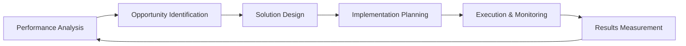

# Optimization Workflow

The **Optimization Workflow** helps you continuously improve your project management processes, identify efficiency opportunities, and implement data-driven improvements. This workflow is designed for weekly execution to maintain peak performance and drive continuous improvement.

**⏱️ Time Required**: 30-60 minutes weekly
**🎯 Outcome**: Measurable improvements in productivity, quality, and team satisfaction
**👥 Best For**: Weekly optimization reviews, process improvement initiatives, performance tuning

## 🎯 Workflow Overview

This workflow implements a systematic optimization cycle:



### What You'll Accomplish

- ✅ **Performance Insights**: Deep understanding of current performance patterns
- ✅ **Improvement Opportunities**: Clear identification of optimization targets
- ✅ **Actionable Solutions**: Specific, implementable improvement plans
- ✅ **Measurable Results**: Quantified impact of optimization efforts
- ✅ **Continuous Learning**: Patterns and insights for future improvements

## 🚀 Weekly Optimization Cycle

### Step 1: Performance Analysis (10 minutes)

Analyze current performance across all key metrics.

#### Comprehensive Performance Review

```bash
# Generate performance report
python -m ai_onboard unified-metrics report --comprehensive

# Analyze trends over time
python -m ai_onboard unified-metrics trend --timeframe 30d --all-metrics

# Compare with baselines
python -m ai_onboard unified-metrics compare --baseline "previous_month"
```

#### Key Performance Areas to Analyze

**Productivity Metrics**

```
📊 Productivity Analysis (Last 30 days)

Velocity Trends: ███████░░░░░░░░░░░░ 68% (+12% vs last month)
Quality Score: █████████░░░░░░░░░░ 82% (+5% vs baseline)
Satisfaction: ██████████░░░░░░░░░ 90% (stable)

🏃‍♂️ Team Performance:
├── Developer Productivity: 1.8 tasks/day (+0.3)
├── Code Quality: 94% pass rate (+2%)
├── Collaboration Score: 87% (+8%)
└── Meeting Efficiency: 4.2/5 satisfaction (+0.4)

⚡ Process Efficiency:
├── Planning Accuracy: 89% (±2%)
├── Task Completion: 92% on time (±3%)
├── Issue Resolution: 3.2 days avg (-0.8)
└── Code Review Time: 1.2 days avg (-0.3)
```

**Quality Metrics**

```bash
# Analyze quality trends
python -m ai_onboard ux analytics user --focus quality --timeframe 30d

# Review error patterns
python -m ai_onboard ux analytics errors --timeframe 30d --by-category

# Check satisfaction trends
python -m ai_onboard ux analytics satisfaction --timeframe 30d --trends
```

### Step 2: Opportunity Identification (10 minutes)

Identify specific areas for improvement based on data analysis.

#### Automated Opportunity Detection

```bash
# Find optimization opportunities
python -m ai_onboard kaizen opportunities \
  --focus "productivity,quality,collaboration" \
  --impact-threshold "medium" \
  --effort-threshold "low" \
  --timeframe 30d
```

#### Manual Opportunity Assessment

```bash
# Review team feedback for opportunities
python -m ai_onboard ux feedback review --timeframe 7d --categorize

# Analyze bottleneck patterns
python -m ai_onboard kaizen analyze-bottlenecks --comprehensive

# Identify collaboration improvements
python -m ai_onboard ai-agent analytics --opportunities --timeframe 30d
```

#### Example Opportunities Report

```
🎯 Optimization Opportunities (Priority Order)

🚨 High Impact, Low Effort:
1. **Code Review Parallelization**
   Impact: +25% review speed, Effort: 2 hours
   Current: Sequential reviews, Proposed: Parallel reviews

2. **Meeting Format Optimization**
   Impact: +40% efficiency, Effort: 1 hour
   Current: 60min daily standup, Proposed: 30min focused standup

3. **Automated Testing Integration**
   Impact: +30% quality, Effort: 4 hours
   Current: Manual testing, Proposed: CI/CD integration

⚠️ Medium Impact, Medium Effort:
4. **Documentation Automation**
   Impact: +15% onboarding speed, Effort: 8 hours
   Current: Manual docs, Proposed: Auto-generated docs

5. **Task Assignment Optimization**
   Impact: +20% balance, Effort: 6 hours
   Current: Manual assignment, Proposed: AI-assisted assignment
```

### Step 3: Solution Design (10 minutes)

Design specific solutions for identified opportunities.

#### Solution Development

```bash
# Design optimization experiments
python -m ai_onboard opt-experiments design \
  --name "code_review_parallelization" \
  --hypothesis "Parallel reviews will increase review speed by 25%" \
  --variants "sequential,parallel_mixed,parallel_full" \
  --metrics "review_time,quality_score,reviewer_satisfaction" \
  --duration "2_weeks"
```

#### Implementation Planning

```bash
# Plan implementation steps
python -m ai_onboard kaizen plan-implementation \
  --opportunity "code_review_parallelization" \
  --steps "setup_parallel_reviews,train_team,monitor_impact" \
  --timeline "1_week" \
  --resources "2_developers,1_hour_training" \
  --rollback-plan "revert_to_sequential"
```

#### Risk Assessment

```bash
# Assess implementation risks
python -m ai_onboard kaizen risk-assessment \
  --opportunity "code_review_parallelization" \
  --risk-categories "quality,team_adoption,timeline" \
  --mitigation-strategies "pilot_testing,training,monitoring"
```

### Step 4: Implementation Planning (5 minutes)

Plan the execution of approved optimizations.

#### Create Implementation Roadmap

```bash
# Generate implementation plan
python -m ai_onboard kaizen implementation-roadmap \
  --opportunities "high_impact_opportunities" \
  --timeline "2_weeks" \
  --resource-constraints "team_capacity,technical_debt" \
  --dependencies "identify_and_sequence"
```

#### Team Assignment and Communication

```bash
# Assign implementation tasks
python -m ai_onboard plan task --create-from-optimization \
  --opportunity "code_review_parallelization" \
  --assignees "dev_team_lead,qa_lead" \
  --priority "high" \
  --deadline "next_sprint"
```

#### Change Communication

```bash
# Generate change communication
python -m ai_onboard prompt communication \
  --type "optimization_implementation" \
  --audience "development_team" \
  --key-points "benefits,implementation_steps,support_resources"
```

### Step 5: Execution & Monitoring (Ongoing)

Implement optimizations with continuous monitoring.

#### Implementation Execution

```bash
# Execute planned optimizations
python -m ai_onboard kaizen implement-optimization \
  --optimization-id "code_review_parallelization_001" \
  --monitoring-enabled true \
  --rollback-prepared true \
  --stakeholder-notification enabled
```

#### Real-time Monitoring

```bash
# Set up monitoring dashboards
python -m ai_onboard unified-metrics dashboard \
  --name "optimization_monitoring" \
  --metrics "review_time,quality_score,team_satisfaction" \
  --update-frequency "real_time" \
  --alert-thresholds "performance_drop:0.9,quality_drop:0.95"
```

#### Progress Tracking

```bash
# Track implementation progress
python -m ai_onboard kaizen track-progress \
  --optimization "code_review_parallelization" \
  --metrics "completion_percentage,impact_realized,team_adoption" \
  --update-frequency "daily" \
  --stakeholder-reports "weekly"
```

### Step 6: Results Measurement (5 minutes)

Measure the impact of implemented optimizations.

#### Impact Assessment

```bash
# Measure optimization results
python -m ai_onboard opt-experiments analyze \
  --experiment "code_review_parallelization" \
  --metrics "review_speed,quality_impact,satisfaction_change" \
  --statistical-significance 0.95 \
  --effect-size-calculation true
```

#### ROI Analysis

```bash
# Calculate return on investment
python -m ai_onboard optimization roi calculate \
  --optimization "code_review_parallelization" \
  --investment "time:8_hours,training:2_hours" \
  --benefits "time_saved:15_hours_weekly,quality_improvement:10_percent" \
  --timeframe "monthly" \
  --calculation-method "cost_benefit"
```

## 🔧 Advanced Optimization Techniques

### Predictive Optimization

#### Set Up Predictive Models

```bash
# Enable predictive optimization
python -m ai_onboard optimization predictive enable \
  --models "velocity_prediction,quality_forecast,risk_prediction" \
  --training-data "historical_projects" \
  --update-frequency "weekly" \
  --accuracy-threshold 0.85
```

#### Risk-Based Optimization

```bash
# Optimize based on risk predictions
python -m ai_onboard optimization predictive risk-optimize \
  --risk-threshold 0.7 \
  --optimization-focus "high_risk_areas" \
  --conservative-approach true \
  --stakeholder-approval "required_for_high_impact"
```

### Custom Optimization Metrics

#### Define Custom Metrics

```bash
# Create project-specific optimization metrics
python -m ai_onboard optimization metrics define \
  --name "development_efficiency_index" \
  --type "composite" \
  --components "velocity,quality,satisfaction,collaboration" \
  --weights "0.3,0.3,0.2,0.2" \
  --calculation "weighted_average"
```

#### Metric-Based Optimization

```bash
# Optimize based on custom metrics
python -m ai_onboard optimization optimize-by-metric \
  --metric "development_efficiency_index" \
  --target-value 0.85 \
  --optimization-areas "process,tools,collaboration" \
  --implementation-priority "impact_first"
```

## 📊 Optimization Analytics Dashboard

### Create Optimization Dashboard

```bash
# Set up comprehensive optimization dashboard
python -m ai_onboard optimization dashboard create \
  --name "continuous_optimization" \
  --sections "performance_trends,opportunity_pipeline,active_optimizations,results_summary" \
  --update-frequency "daily" \
  --stakeholder-access "enabled"
```

### Key Dashboard Components

**Performance Trends Section**

- Velocity trends over time
- Quality metrics progression
- Team satisfaction evolution
- Process efficiency improvements

**Opportunity Pipeline Section**

- Identified opportunities by impact/effort
- Prioritized optimization backlog
- Implementation timeline
- Resource allocation status

**Active Optimizations Section**

- Currently running experiments
- Implementation progress
- Real-time monitoring data
- Early warning indicators

**Results Summary Section**

- Completed optimizations ROI
- Impact measurements
- Success rate tracking
- Lessons learned repository

## 🎓 Optimization Best Practices

### Weekly Optimization Habits

1. **Data-Driven Decisions**: Always base optimizations on metrics and data
2. **Small Iterations**: Start with small, low-risk improvements
3. **Stakeholder Involvement**: Include affected teams in optimization decisions
4. **Continuous Monitoring**: Track impact throughout implementation

### Experiment Best Practices

1. **Clear Hypotheses**: Define specific, testable optimization hypotheses
2. **Proper Controls**: Use appropriate control groups for comparison
3. **Statistical Rigor**: Ensure statistical significance in results analysis
4. **Ethical Considerations**: Consider impact on team members and stakeholders

### Implementation Best Practices

1. **Gradual Rollout**: Implement optimizations incrementally when possible
2. **Rollback Planning**: Always prepare rollback plans for critical optimizations
3. **Training and Support**: Provide adequate training for new processes
4. **Communication**: Keep all stakeholders informed throughout implementation

## 🚨 Optimization Troubleshooting

### Common Issues and Solutions

#### Issue: Optimization suggestions not helpful

**Symptoms**: Generated opportunities don't match team needs
**Solutions**:

```bash
# Review opportunity generation parameters
python -m ai_onboard kaizen opportunities --review-parameters

# Adjust focus areas and thresholds
python -m ai_onboard kaizen opportunities --focus "team_identified" --impact-threshold "high"

# Incorporate team feedback
python -m ai_onboard ux feedback incorporate --optimization-suggestions
```

#### Issue: Optimization implementation failing

**Symptoms**: Planned optimizations can't be implemented
**Solutions**:

```bash
# Analyze implementation blockers
python -m ai_onboard kaizen analyze-blockers --optimization "failed_optimization"

# Adjust implementation approach
python -m ai_onboard kaizen adjust-implementation \
  --optimization "failed_optimization" \
  --approach "simplified" \
  --timeline "extended"

# Get alternative suggestions
python -m ai_onboard kaizen alternatives --optimization "failed_optimization"
```

#### Issue: No measurable improvement

**Symptoms**: Implemented optimizations show no impact
**Solutions**:

```bash
# Review measurement methodology
python -m ai_onboard optimization measurement review --optimization "no_impact_optimization"

# Adjust success metrics
python -m ai_onboard optimization metrics adjust --optimization "no_impact_optimization"

# Extend measurement period
python -m ai_onboard optimization measurement extend --optimization "no_impact_optimization"
```

## 🎯 Optimization Success Metrics

### Weekly Success Indicators

- ✅ **Opportunities Identified**: 3-5 high-quality improvement opportunities found
- ✅ **Solutions Designed**: Specific, actionable improvement plans created
- ✅ **Implementation Started**: At least one optimization implemented
- ✅ **Progress Monitored**: Real-time tracking of optimization impact

### Monthly Success Indicators

- ✅ **Measurable Improvements**: 10-20% improvement in key metrics
- ✅ **ROI Achievement**: Positive return on optimization investment
- ✅ **Team Adoption**: Successful adoption of implemented optimizations
- ✅ **Continuous Pipeline**: Steady stream of new optimization opportunities

### Long-term Success Indicators

- ✅ **Sustained Improvement**: Consistent year-over-year performance gains
- ✅ **Culture of Optimization**: Team actively identifies and implements improvements
- ✅ **Predictive Capability**: Ability to anticipate and prevent performance issues
- ✅ **Competitive Advantage**: Optimization-driven productivity and quality leadership

---

**🚀 Ready to optimize continuously?** Start with [Performance Analysis](#performance-analysis) and work through the complete [Optimization Cycle](#weekly-optimization-cycle)!

**❓ Need help with specific optimizations?** Check the [Kaizen Guide](../optimization/README.md#kaizen-implementation) or [Experiment Framework](../optimization/README.md#experiment-framework).

**🔧 Want to troubleshoot issues?** See the [Troubleshooting](#optimization-troubleshooting) section.
