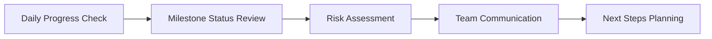

# Progress Monitoring Workflow

The **Progress Monitoring Workflow** helps you track project progress, identify issues early, and maintain alignment with your project vision. This workflow is designed for daily use to keep your project on track and your team informed.

**⏱️ Time Required**: 2-5 minutes daily
**🎯 Outcome**: Clear visibility into project progress and early issue detection
**👥 Best For**: Daily standups, sprint reviews, stakeholder updates

## 🎯 Workflow Overview

This workflow implements a systematic approach to progress tracking:



### What You'll Accomplish

- ✅ **Real-time Progress Visibility**: Current status of all project components
- ✅ **Early Issue Detection**: Identify blockers and delays before they become critical
- ✅ **Team Alignment**: Ensure everyone understands current priorities and status
- ✅ **Stakeholder Communication**: Generate clear progress reports for stakeholders
- ✅ **Predictive Insights**: Forecast completion dates and identify trends

## 🚀 Daily Progress Monitoring

### Step 1: Quick Status Overview (1 minute)

Get a comprehensive view of your project's current state.

#### Dashboard Check

```bash
# Quick project status
python -m ai_onboard dashboard

# Detailed progress view
python -m ai_onboard dashboard --detailed

# Team-focused dashboard
python -m ai_onboard dashboard --team
```

#### Key Metrics to Review

```
📊 Project Progress Overview

Overall Progress: ████████░░░░░░░░░░░░ 45.2%

📈 Milestones:
├── Foundation        ████████████████ 100% ✅
├── Core Development  █████░░░░░░░░░░░  35% 🔄
├── Testing           ░░░░░░░░░░░░░░░░   0% ⏳
└── Deployment        ░░░░░░░░░░░░░░░░   0% ⏳

🎯 Current Focus: T7 - Real-time collaboration features
⏱️ Time Remaining: 6.2 weeks (on track)

💡 Smart Suggestions:
• Consider parallel testing for T6 components
• Schedule user feedback session for T7
• Review T8 mobile requirements early
```

#### Critical Path Analysis

```bash
# Analyze critical path
python -m ai_onboard project critical-path

# Check for bottlenecks
python -m ai_onboard project critical-path --bottlenecks

# Optimize critical path
python -m ai_onboard project critical-path --optimize
```

### Step 2: Milestone and Task Review (1-2 minutes)

Review the status of active milestones and tasks.

#### Milestone Status Check

```bash
# Current milestone status
python -m ai_onboard plan milestone --status

# Upcoming milestones
python -m ai_onboard plan milestone --upcoming

# Milestone progress details
python -m ai_onboard plan milestone --progress M2
```

#### Task Progress Review

```bash
# Active tasks overview
python -m ai_onboard plan task --list --status active

# Blocked tasks
python -m ai_onboard plan task --list --status blocked

# Completed tasks this week
python -m ai_onboard plan task --completed --timeframe 7d
```

#### Task Completion Detection

```bash
# Detect automatically completed tasks
python -m ai_onboard project task-completion

# Update task status
python -m ai_onboard plan task --complete T5 --notes "Completed ahead of schedule"

# Mark tasks as blocked
python -m ai_onboard plan task --block T7 --reason "waiting_for_design_approval"
```

### Step 3: Risk Assessment (30 seconds)

Identify potential issues and risks early.

#### Risk Detection

```bash
# Automated risk assessment
python -m ai_onboard validate --risk-assessment

# Timeline risk analysis
python -m ai_onboard plan --validate-timeline

# Resource risk check
python -m ai_onboard plan --validate-resources
```

#### Risk Indicators to Watch

- **Velocity Drop**: Team completing fewer tasks than planned
- **Quality Issues**: Increasing defect rates or test failures
- **Timeline Slippage**: Tasks consistently taking longer than estimated
- **Resource Constraints**: Team members overloaded or unavailable
- **Dependency Issues**: Blocked tasks creating bottlenecks

### Step 4: Team Communication (30 seconds)

Share progress updates with your team.

#### Generate Progress Reports

```bash
# Generate daily progress report
python -m ai_onboard prompt progress --daily

# Create team update
python -m ai_onboard prompt progress --team-update

# Executive summary
python -m ai_onboard prompt progress --executive-summary
```

#### Automated Notifications

```bash
# Set up progress notifications
python -m ai_onboard unified-metrics alert \
  --progress-drop-threshold 0.8 \
  --notification-channel "#project-updates" \
  --frequency daily

# Milestone completion alerts
python -m ai_onboard unified-metrics alert \
  --milestone-completion enabled \
  --notify-stakeholders true
```

### Step 5: Next Steps Planning (30 seconds)

Plan your immediate next steps based on current status.

#### Priority Identification

```bash
# Get task priorities
python -m ai_onboard project prioritize

# Next high-impact tasks
python -m ai_onboard suggest --context "current_progress"

# Critical path tasks
python -m ai_onboard project critical-path --next-tasks
```

#### Tomorrow's Focus

```bash
# Plan tomorrow's work
python -m ai_onboard suggest --tomorrow

# Get AI-powered recommendations
python -m ai_onboard suggest --focus "productivity"

# Team capacity planning
python -m ai_onboard plan --capacity-planning --timeframe 1d
```

## 📊 Weekly Progress Review

### Comprehensive Weekly Assessment (10-15 minutes)

#### Weekly Progress Summary

```bash
# Generate weekly progress report
python -m ai_onboard prompt progress --weekly

# Compare with previous week
python -m ai_onboard prompt progress --compare-weeks

# Trend analysis
python -m ai_onboard unified-metrics trend --timeframe 30d --metric velocity
```

#### Team Performance Review

```bash
# Team velocity analysis
python -m ai_onboard ux analytics user --team --timeframe 7d

# Individual contributions
python -m ai_onboard ux analytics user --individual --timeframe 7d

# Collaboration patterns
python -m ai_onboard ai-agent analytics --collaboration --timeframe 7d
```

#### Milestone Planning

```bash
# Review milestone progress
python -m ai_onboard plan milestone --review --timeframe 7d

# Plan next milestone
python -m ai_onboard plan milestone --next --dependencies

# Adjust timeline if needed
python -m ai_onboard plan milestone --adjust --milestone M3 --new-date "2025-02-15"
```

## 🔧 Advanced Progress Monitoring

### Custom Progress Metrics

#### Define Project-Specific Metrics

```bash
# Create custom progress metrics
python -m ai_onboard optimization metrics define \
  --name "feature_completion_rate" \
  --type "calculated" \
  --formula "completed_features / total_features * 100" \
  --update-frequency "daily"
```

#### Set Up Progress Alerts

```bash
# Configure progress-based alerts
python -m ai_onboard unified-metrics alert \
  --metric "velocity" \
  --condition "below_threshold" \
  --threshold 0.8 \
  --action "notify_team_lead,create_followup_task" \
  --cooldown "1d"
```

### Predictive Progress Analysis

#### Forecast Completion Dates

```bash
# Predict project completion
python -m ai_onboard optimization predictive \
  --model "completion_prediction" \
  --confidence-level 0.95 \
  --factors "velocity_trends,resource_availability,risk_factors"
```

#### Risk-Based Timeline Adjustments

```bash
# Analyze timeline risks
python -m ai_onboard optimization predictive risk \
  --timeline-analysis enabled \
  --risk-threshold 0.7 \
  --adjustment-recommendations true
```

## 🎓 Progress Monitoring Best Practices

### Daily Monitoring Habits

1. **Consistent Timing**: Check progress at the same time each day
2. **Quick Assessment**: Focus on key metrics and exceptions first
3. **Team Communication**: Share progress updates immediately after review
4. **Action-Oriented**: Always identify next steps and assign responsibilities

### Weekly Review Practices

1. **Comprehensive Analysis**: Review all aspects of project progress
2. **Trend Identification**: Look for patterns in velocity and quality metrics
3. **Stakeholder Updates**: Prepare clear summaries for stakeholders
4. **Continuous Improvement**: Use insights to improve future progress tracking

### Issue Resolution Strategies

1. **Early Detection**: Address issues as soon as they're identified
2. **Root Cause Analysis**: Understand why issues occurred to prevent recurrence
3. **Collaborative Resolution**: Involve relevant team members in issue resolution
4. **Documentation**: Record issues and resolutions for future reference

## 🚨 Progress Monitoring Troubleshooting

### Common Issues and Solutions

#### Issue: Progress not updating automatically

**Symptoms**: Dashboard shows outdated information
**Solutions**:

```bash
# Force progress refresh
python -m ai_onboard project progress --refresh

# Check for sync issues
python -m ai_onboard project task-completion --force-sync

# Validate data sources
python -m ai_onboard validate --data-sources
```

#### Issue: Inaccurate progress calculations

**Symptoms**: Progress percentages don't match reality
**Solutions**:

```bash
# Recalculate progress
python -m ai_onboard project progress --recalculate

# Review task weightings
python -m ai_onboard plan task --review-weightings

# Adjust estimation accuracy
python -m ai_onboard plan --calibrate-estimates
```

#### Issue: Missing progress data

**Symptoms**: Dashboard shows incomplete information
**Solutions**:

```bash
# Check data collection status
python -m ai_onboard unified-metrics status

# Reinitialize metrics collection
python -m ai_onboard unified-metrics setup --force

# Verify integration connections
python -m ai_onboard config integrations test --all
```

## 🎯 Progress Monitoring Success Metrics

### Daily Success Indicators

- ✅ **Quick Assessment**: Complete daily check in under 2 minutes
- ✅ **Issue Detection**: Identify potential issues before they become critical
- ✅ **Team Awareness**: All team members understand current priorities
- ✅ **Action Items**: Clear next steps identified and assigned

### Weekly Success Indicators

- ✅ **Trend Visibility**: Clear understanding of velocity and quality trends
- ✅ **Milestone Tracking**: Accurate milestone progress and forecasting
- ✅ **Stakeholder Satisfaction**: Clear, informative progress reports
- ✅ **Predictive Accuracy**: Forecasts within 10% of actual outcomes

### Long-term Success Indicators

- ✅ **Improved Velocity**: Consistent improvement in team delivery speed
- ✅ **Reduced Issues**: Fewer critical issues and blockers
- ✅ **Better Planning**: More accurate project planning and estimation
- ✅ **Team Satisfaction**: Team members feel informed and aligned

---

**🚀 Ready to master progress monitoring?** Start with the [Daily Progress Check](#daily-progress-monitoring) and build up to [Weekly Reviews](#weekly-progress-review)!

**❓ Need help with specific monitoring?** Check the [Dashboard Guide](dashboard.md) or [Metrics Guide](../optimization/README.md#performance-metrics).

**🔧 Want to troubleshoot issues?** See the [Troubleshooting](#progress-monitoring-troubleshooting) section.
