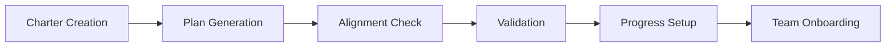

# Project Setup Workflow

The **Project Setup Workflow** is your foundation for success. This intelligent workflow guides you through creating a strong project foundation that keeps your team aligned and productive throughout the entire development lifecycle.

**⏱️ Time Required**: 15-30 minutes
**🎯 Outcome**: Complete project foundation with vision, plan, and validation
**👥 Best For**: New projects, project restarts, team onboarding

## 🎯 Workflow Overview

This workflow implements the proven **Vision → Plan → Align → Validate** methodology:



### What You'll Accomplish
- ✅ **Clear Project Vision**: Well-defined charter with goals and success criteria
- ✅ **Intelligent Project Plan**: AI-generated roadmap with tasks and milestones
- ✅ **Alignment Verification**: Confirmation that plan matches vision
- ✅ **Quality Validation**: Health check of project foundation
- ✅ **Progress Tracking**: Dashboard and monitoring setup
- ✅ **Team Readiness**: Onboarding materials and collaboration setup

## 🚀 Step-by-Step Workflow

### Step 1: Project Charter Creation (8-12 minutes)

The charter defines your project's **why**, **what**, and **who** - the foundation everything else builds on.

#### Interactive Charter Creation
```bash
python -m ai_onboard charter
```

#### What to Expect
The system will guide you through a structured interrogation process:

##### Vision Core Questions
**Q: What problem does this project solve?**
- Be specific about the pain point
- Focus on user/business impact
- Example: *"Remote teams struggle with fragmented task tracking across 5+ tools, leading to 30% time waste on coordination"*

**Q: What is your ideal outcome?**
- Describe the perfect end state
- Include measurable benefits
- Example: *"Teams collaborate seamlessly in one platform, reducing coordination time by 60% and improving delivery speed by 40%"*

**Q: Who are your primary users?**
- Define your target audience clearly
- Include their key characteristics
- Example: *"Remote development teams of 5-20 people, tech-savvy, using agile methodologies"*

##### Success Criteria Definition
**Q: How will you measure success?**
- Define 3-5 measurable criteria
- Include both quantitative and qualitative metrics
- Example:
  - *"User satisfaction score >4.5/5"*
  - *"80% feature adoption within 3 months"*
  - *"50% reduction in coordination time"*
  - *"90% user retention after 6 months"*

**Q: What are your key constraints?**
- Time, budget, technical limitations
- Regulatory or compliance requirements
- Example: *"6-month timeline, $50k budget, GDPR compliance, mobile-first design"*

##### Stakeholder Mapping
**Q: Who are your key stakeholders?**
- Decision makers, users, influencers
- Their roles and expectations
- Example:
  - *"Product Manager (final decisions, ROI focus)"*
  - *"Development Team (implementation, technical quality)"*
  - *"End Users (usability, feature needs)"*
  - *"Executive Sponsor (strategic alignment, budget)"*

#### Charter Quality Validation
The system automatically validates your charter for:
- **Vision Clarity**: Clear, compelling vision statement
- **Measurable Goals**: Specific, achievable success criteria
- **Stakeholder Alignment**: Well-defined roles and expectations
- **Constraint Reality**: Realistic timeline and resource constraints

#### Example Charter Output
```yaml
project_name: "TeamFlow - Unified Remote Collaboration"
vision_statement: "Transform remote team collaboration through intelligent task coordination"

problem_statement: |
  Remote development teams lose 30% productivity due to fragmented tools
  and poor coordination, leading to missed deadlines and team frustration.

ideal_outcome: |
  Teams achieve seamless collaboration in a unified platform, improving
  delivery speed by 40% and team satisfaction by 60%.

success_criteria:
  quantitative:
    - "User satisfaction score >4.5/5"
    - "80% feature adoption within 3 months"
    - "50% reduction in coordination overhead"
    - "40% improvement in delivery velocity"
  qualitative:
    - "Teams report feeling more connected and aligned"
    - "Reduced stress and frustration around task management"

primary_users:
  - profile: "Remote Development Teams"
    size: "5-20 members"
    characteristics: ["Tech-savvy", "Agile methodology", "Global distribution"]

stakeholders:
  - role: "Product Manager"
    expectations: "ROI demonstration, strategic alignment"
  - role: "Development Team"
    expectations: "Technical excellence, maintainable architecture"
  - role: "End Users"
    expectations: "Intuitive interface, reliable performance"

constraints:
  timeline: "6 months to MVP"
  budget: "$75,000 development budget"
  technical: "Mobile-first, API-driven architecture"
  compliance: "GDPR, SOC2 compliance required"

created_at: "2025-01-15T10:30:00Z"
charter_version: "1.0"
```

### Step 2: Intelligent Plan Generation (5-8 minutes)

With your vision defined, AI Onboard generates a comprehensive project plan tailored to your specific needs.

#### Generate Your Plan
```bash
python -m ai_onboard plan
```

#### AI-Powered Planning Features

##### Smart Work Breakdown Structure
- **Phase-Based Organization**: Logical project phases (Foundation, Development, Testing, Launch)
- **Task Dependencies**: Automatic dependency detection and sequencing
- **Effort Estimation**: AI-powered effort estimates based on project patterns
- **Critical Path Analysis**: Identification of critical path and potential bottlenecks

##### Example Plan Structure
```
📋 TeamFlow Project Plan

🎯 Phase 1: Foundation & Research (3 weeks)
├── T1: User research and persona development (5 days)
│   ├── Stakeholder interviews (2 days)
│   ├── User journey mapping (2 days)
│   └── Persona documentation (1 day)
├── T2: Technical architecture design (4 days)
│   ├── System architecture planning (2 days)
│   ├── Technology stack selection (1 day)
│   └── Infrastructure planning (1 day)
├── T3: UI/UX design system (6 days)
│   ├── Wireframes and user flows (3 days)
│   ├── Visual design system (2 days)
│   └── Prototype development (1 day)
└── T4: Development environment setup (2 days)

🏗️ Phase 2: Core Development (8 weeks)
├── T5: User authentication & security (6 days)
├── T6: Task management core engine (10 days)
├── T7: Real-time collaboration features (8 days)
├── T8: Mobile-responsive interface (12 days)
├── T9: Notification & communication system (6 days)
└── T10: Integration APIs (8 days)

🧪 Phase 3: Testing & Quality Assurance (3 weeks)
├── T11: Automated testing suite (6 days)
├── T12: User acceptance testing (4 days)
├── T13: Performance optimization (5 days)
└── T14: Security audit & compliance (6 days)

🚀 Phase 4: Launch & Stabilization (2 weeks)
├── T15: Production deployment (3 days)
├── T16: User onboarding & documentation (4 days)
├── T17: Launch monitoring & support (4 days)
└── T18: Post-launch optimization (3 days)

📊 Plan Summary:
Total Tasks: 18
Estimated Duration: 16 weeks
Critical Path: T1 → T2 → T5 → T6 → T7 → T11 → T15
Resource Requirements: 2-3 developers, 1 designer, 1 PM
```

##### Intelligent Milestone Definition
```
🎯 Key Milestones:

M1: Foundation Complete (Week 3)
├── User research validated
├── Technical architecture approved
├── Design system established
└── Development environment ready

M2: Core MVP Ready (Week 11)
├── Authentication system live
├── Basic task management functional
├── Real-time collaboration working
└── Mobile interface responsive

M3: Launch Ready (Week 14)
├── All features tested and validated
├── Performance benchmarks met
├── Security audit passed
└── User documentation complete

M4: Stable Production (Week 16)
├── Production deployment successful
├── User onboarding smooth
├── Support processes operational
└── Success metrics tracking active
```

### Step 3: Alignment Verification (2-3 minutes)

Ensure your generated plan truly aligns with your project vision and constraints.

#### Run Alignment Check
```bash
python -m ai_onboard align
```

#### Alignment Analysis
The system performs comprehensive alignment checking:

##### Vision-Plan Alignment
- **Goal Coverage**: Are all success criteria addressed in the plan?
- **User Focus**: Does the plan prioritize primary user needs?
- **Constraint Compliance**: Does the plan respect timeline and budget constraints?
- **Stakeholder Value**: Does each phase deliver value to key stakeholders?

##### Example Alignment Report
```
🎯 Alignment Analysis: TeamFlow Project

✅ Vision Alignment Score: 92/100

📊 Detailed Analysis:

Goal Coverage (95/100):
✅ User satisfaction → Addressed in T12 (User acceptance testing)
✅ Feature adoption → Covered by T16 (User onboarding)
✅ Coordination efficiency → Core focus of T6, T7, T9
⚠️  Delivery velocity → Consider adding velocity tracking in T17

Constraint Compliance (90/100):
✅ Timeline: 16 weeks vs 24 week constraint ✅
✅ Budget: Estimated $65k vs $75k budget ✅
⚠️  Mobile-first: Ensure T8 prioritizes mobile (currently scheduled late)
✅ Compliance: T14 addresses GDPR and SOC2 requirements

Stakeholder Value (91/100):
✅ Product Manager: Clear ROI tracking and milestone reporting
✅ Development Team: Well-structured technical phases
✅ End Users: Strong UX focus in foundation phase
⚠️  Executive Sponsor: Consider adding executive reporting in milestones

💡 Recommended Adjustments:
1. Move mobile development (T8) earlier in Phase 2
2. Add velocity tracking metrics to T17
3. Include executive milestone reports
4. Consider parallel development of T6 and T7 to save 2 weeks
```

#### Alignment Approval
```bash
# Approve alignment with notes
python -m ai_onboard align --approve --note "Approved with mobile-first prioritization"

# Request alignment adjustments
python -m ai_onboard align --adjust --focus "mobile_first,velocity_tracking"
```

### Step 4: Foundation Validation (2-3 minutes)

Validate that your project foundation is solid and ready for development.

#### Comprehensive Validation
```bash
python -m ai_onboard validate
```

#### Validation Categories

##### Project Health Check
- **Charter Quality**: Vision clarity, goal specificity, stakeholder definition
- **Plan Viability**: Realistic timelines, proper dependencies, resource allocation
- **Risk Assessment**: Potential blockers, mitigation strategies, contingency plans
- **Team Readiness**: Skill alignment, capacity planning, collaboration setup

##### Example Validation Report
```
🔍 Project Foundation Validation: TeamFlow

Overall Health Score: 87/100 ✅

📋 Charter Validation (92/100):
✅ Vision Statement: Clear and compelling
✅ Success Criteria: Specific and measurable
✅ Stakeholder Mapping: Comprehensive and realistic
⚠️  Risk Assessment: Consider adding technical risk mitigation

📊 Plan Validation (85/100):
✅ Task Structure: Well-organized and logical
✅ Dependencies: Properly identified and sequenced
⚠️  Resource Planning: Consider frontend specialist for T8
⚠️  Buffer Time: Add 10% buffer for integration challenges

🎯 Alignment Validation (90/100):
✅ Goal Achievement: Plan addresses all success criteria
✅ Constraint Compliance: Timeline and budget realistic
✅ Stakeholder Value: Each phase delivers stakeholder value

⚡ Risk Analysis (80/100):
✅ Technical Risks: Architecture choices well-justified
⚠️  Market Risks: Consider competitive analysis
⚠️  Team Risks: Ensure knowledge sharing for key components
✅ Timeline Risks: Reasonable estimates with some buffer

💡 Recommendations:
1. Add technical risk mitigation to charter
2. Include frontend specialist in resource planning
3. Add 2-week buffer to Phase 2 timeline
4. Conduct competitive analysis in T1
5. Implement knowledge sharing protocols
```

### Step 5: Progress Tracking Setup (3-5 minutes)

Set up intelligent progress monitoring and dashboard visualization.

#### Initialize Progress Tracking
```bash
# Set up project dashboard
python -m ai_onboard dashboard --setup

# Configure progress metrics
python -m ai_onboard unified-metrics config --project-setup

# Enable intelligent alerts
python -m ai_onboard unified-metrics alert --setup-defaults
```

#### Dashboard Configuration
```bash
# Customize dashboard for your team
python -m ai_onboard config dashboard \
  --widgets "progress,milestones,risks,team_velocity" \
  --update-frequency "daily" \
  --alert-thresholds "velocity:0.8,quality:0.9"
```

#### Example Dashboard Setup
```
📊 TeamFlow Dashboard Configuration

✅ Progress Widgets Enabled:
├── Overall Progress Bar (visual completion %)
├── Milestone Timeline (upcoming deadlines)
├── Team Velocity Chart (tasks completed/week)
├── Quality Metrics (test coverage, bug rates)
├── Risk Indicators (blocked tasks, overdue items)
└── Stakeholder Updates (automated reporting)

⚡ Smart Alerts Configured:
├── Velocity Drop: Alert if <80% of planned velocity
├── Quality Gates: Alert if test coverage <90%
├── Timeline Risk: Alert if milestone at risk
├── Resource Issues: Alert for team capacity problems
└── Stakeholder Updates: Weekly automated reports

🎯 Reporting Schedule:
├── Daily: Team standup dashboard
├── Weekly: Progress and velocity reports
├── Milestone: Stakeholder update reports
└── Monthly: Strategic alignment reviews
```

### Step 6: Team Onboarding Setup (2-5 minutes)

Prepare your team for successful collaboration with shared understanding and tools.

#### Generate Team Resources
```bash
# Create team onboarding materials
python -m ai_onboard prompt team-onboarding

# Set up collaboration protocols
python -m ai_onboard ai-agent --team-setup

# Configure shared workflows
python -m ai_onboard workflow export --team-template
```

#### Team Onboarding Package
```
📚 TeamFlow Team Onboarding Package

🎯 Project Overview:
├── Vision & Goals Summary
├── Success Criteria & Metrics
├── Timeline & Milestone Overview
└── Stakeholder Roles & Expectations

🛠️ Development Setup:
├── Technical Architecture Overview
├── Development Environment Setup
├── Code Standards & Guidelines
└── Testing & Quality Protocols

🔄 Workflow Guidelines:
├── Daily Standup Process
├── Task Management Workflow
├── Code Review Process
├── Deployment & Release Process

📊 Tools & Resources:
├── Project Dashboard Access
├── Communication Channels
├── Documentation Repositories
└── Monitoring & Analytics Access

🎓 Training Materials:
├── AI Onboard Usage Guide
├── Workflow Best Practices
├── Troubleshooting Resources
└── Success Pattern Examples
```

## 🎯 Workflow Success Metrics

### Immediate Success Indicators (First Week)
- ✅ **Charter Clarity Score**: >85/100 on AI Onboard validation
- ✅ **Plan Viability Score**: >80/100 with realistic timelines
- ✅ **Team Alignment**: All team members understand vision and their role
- ✅ **Dashboard Active**: Progress tracking operational and being used daily

### Short-term Success Indicators (First Month)
- ✅ **Velocity Stability**: Consistent task completion rate within 20% of planned
- ✅ **Quality Maintenance**: <5% defect rate, >90% test coverage
- ✅ **Stakeholder Satisfaction**: Regular positive feedback from key stakeholders
- ✅ **Risk Management**: Proactive identification and mitigation of blockers

### Long-term Success Indicators (3-6 Months)
- ✅ **Goal Achievement**: Meeting or exceeding defined success criteria
- ✅ **Timeline Performance**: Delivering milestones on or ahead of schedule
- ✅ **Budget Compliance**: Staying within or under budget constraints
- ✅ **Team Satisfaction**: High team morale and collaboration effectiveness

## 🔧 Workflow Customization

### For Different Project Types

#### Software Development Projects
```bash
# Enhanced technical planning
python -m ai_onboard charter --template software_development
python -m ai_onboard plan --include-architecture --include-testing
python -m ai_onboard validate --technical-depth
```

#### Product Launch Projects
```bash
# Market-focused planning
python -m ai_onboard charter --template product_launch
python -m ai_onboard plan --include-marketing --include-user-research
python -m ai_onboard validate --market-readiness
```

#### Team Transformation Projects
```bash
# Change management focus
python -m ai_onboard charter --template team_transformation
python -m ai_onboard plan --include-training --include-adoption
python -m ai_onboard validate --change-readiness
```

### For Different Team Sizes

#### Small Teams (2-5 people)
- Simplified stakeholder structure
- Combined roles and responsibilities
- Streamlined communication protocols
- Flexible milestone definitions

#### Medium Teams (6-15 people)
- Clear role definitions and boundaries
- Structured communication channels
- Formal milestone and review processes
- Specialized skill area planning

#### Large Teams (15+ people)
- Hierarchical stakeholder management
- Complex dependency tracking
- Formal governance processes
- Cross-team coordination protocols

## 🚀 Advanced Workflow Features

### AI-Powered Enhancements

#### Intelligent Charter Assistance
```bash
# Get charter suggestions based on project type
python -m ai_onboard charter --ai-assist --project-type "saas_platform"

# Validate charter against best practices
python -m ai_onboard charter --validate-best-practices

# Generate charter from existing documentation
python -m ai_onboard charter --from-docs "docs/requirements/"
```

#### Smart Plan Optimization
```bash
# Optimize plan for team velocity
python -m ai_onboard plan --optimize-velocity

# Adjust plan for risk tolerance
python -m ai_onboard plan --risk-level conservative

# Generate alternative plan scenarios
python -m ai_onboard plan --scenarios "aggressive,conservative,balanced"
```

### Integration Features

#### Version Control Integration
```bash
# Link plan to Git repository
python -m ai_onboard plan --git-integration --repo-url <url>

# Sync milestones with Git tags
python -m ai_onboard plan milestone --sync-git-tags

# Generate commit templates from tasks
python -m ai_onboard plan task --generate-commit-templates
```

#### Project Management Tool Integration
```bash
# Export to Jira/Asana/Trello
python -m ai_onboard plan --export-jira --project-key TEAM

# Sync with external PM tools
python -m ai_onboard plan --sync-external --tool jira

# Import existing project data
python -m ai_onboard plan --import-external --source jira --project-key TEAM
```

## 🎓 Mastery Tips

### Expert-Level Workflow Optimization

#### 1. Parallel Workflow Execution
- Run charter validation while plan is generating
- Prepare team onboarding materials during alignment check
- Set up monitoring during validation phase

#### 2. Template-Based Acceleration
- Create reusable charter templates for common project types
- Build standardized plan structures for your organization
- Develop team-specific onboarding workflows

#### 3. Continuous Improvement Integration
- Track workflow execution time and optimize bottlenecks
- Measure success correlation with different workflow variations
- Adapt workflow based on team feedback and project outcomes

#### 4. Stakeholder Communication Automation
- Auto-generate stakeholder updates from progress data
- Create custom reporting templates for different audiences
- Set up proactive communication triggers for risks and achievements

---

## 🎯 Next Steps

### Immediate Actions
1. **Execute the Workflow**: Follow this guide step-by-step for your current project
2. **Customize for Your Team**: Adapt the workflow to your specific needs and constraints
3. **Measure and Improve**: Track success metrics and optimize your approach

### Continue Learning
- **Next Workflow**: [Progress Monitoring Workflow](progress-monitoring.md)
- **Advanced Features**: [Planning & Roadmapping](planning-roadmapping.md)
- **Team Collaboration**: [Multi-Agent Collaboration](multi-agent.md)

### Get Support
- **Troubleshooting**: [Common Setup Issues](../troubleshooting.md#project-setup)
- **Best Practices**: [Project Setup Best Practices](../advanced/project-setup-best-practices.md)
- **Community**: [Share Your Setup Success](../community/success-stories.md)

---

**🚀 Ready to build your project foundation?** Start with `python -m ai_onboard charter` and follow this workflow to create a solid foundation for project success!
